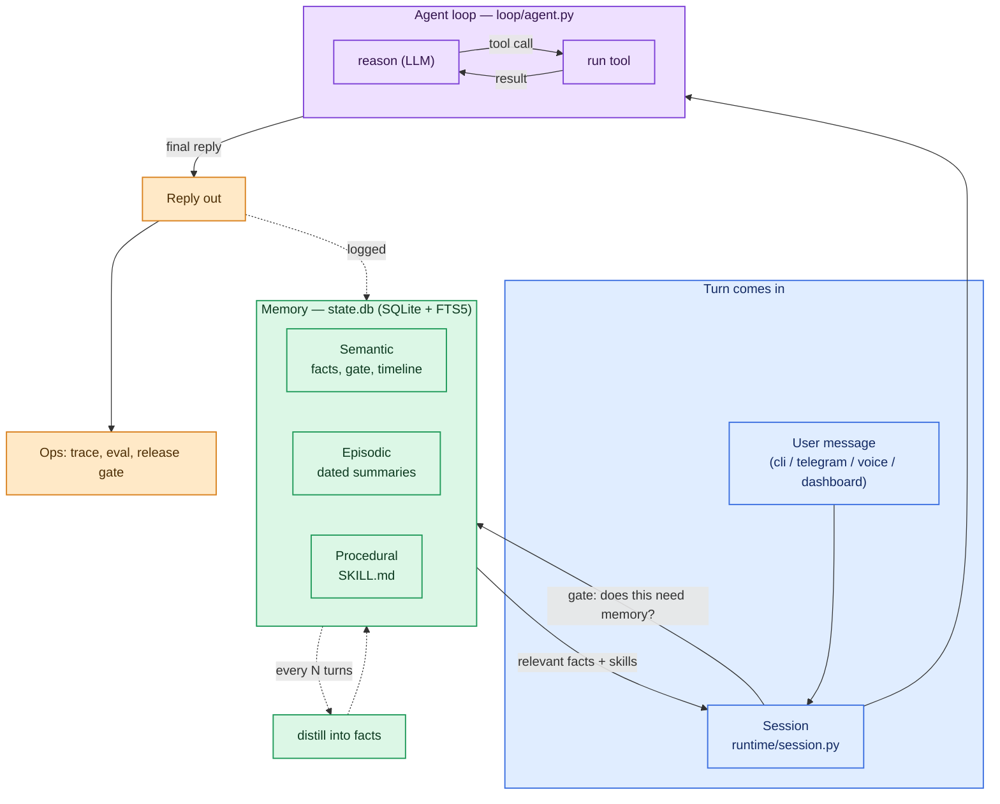
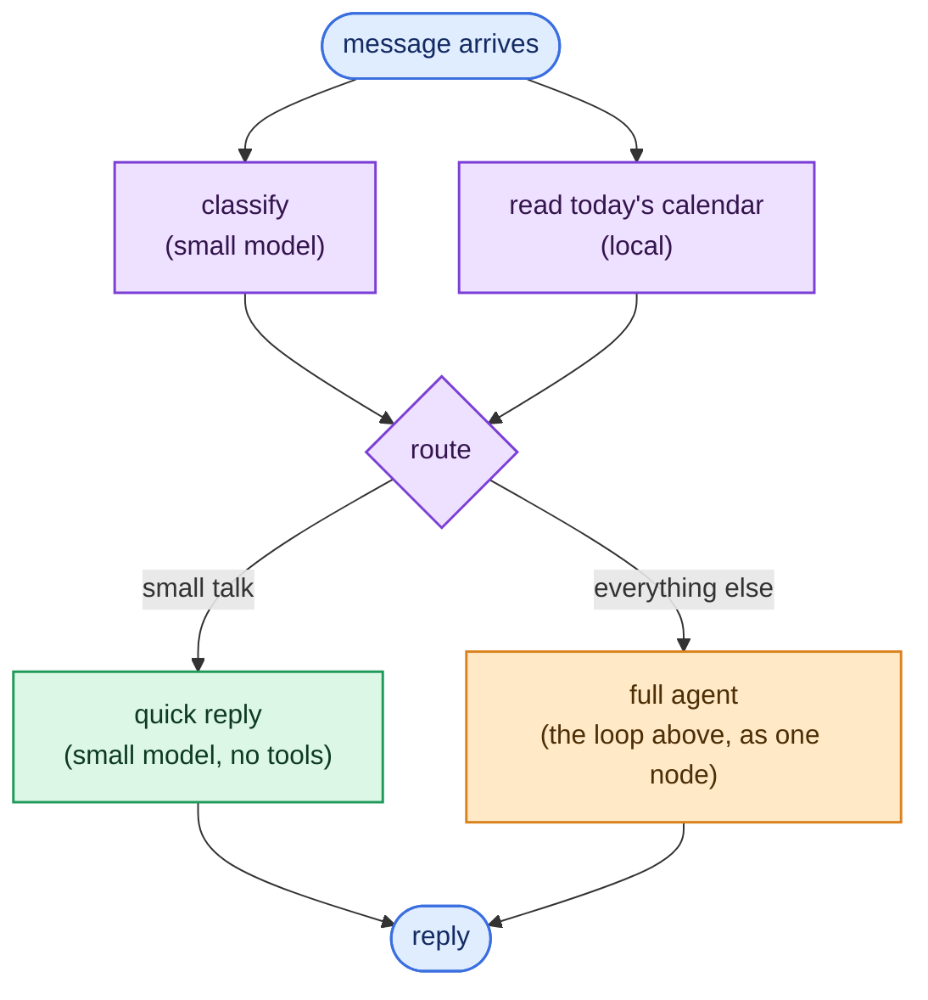

# sieve-agent

[](https://github.com/sridhar-3009/sieve-agent/actions/workflows/validate-skills.yml)
[](LICENSE)
[](pyproject.toml)

**A local-first personal assistant with memory that curates itself.**

sieve-agent shows the four pillars behind every serious agent — **Harness · Loop · Memory ·
Eval/LLM-Ops** — with the memory pillar rebuilt around one idea: your assistant's memory should
curate itself, not just grow forever. Most agent memories only ask "does this turn need to
*read* memory?" before a lookup. Nothing asks the equally important question *before writing*:
is this candidate worth keeping at all? sieve-agent answers that with three mechanisms working
together — see [the three memory mechanisms](#the-three-memory-mechanisms) below.

- **Local-first.** Your memory is one SQLite file. Open it. Read it. It's yours.
- **Memory curates itself.** A write gate rejects noise before it's stored; contradicting facts
  supersede each other into a timeline instead of piling up; stale facts decay and self-archive.
- **The loop is ~95 lines** of plain Python. Step through it.
- **Watch it think.** A local dashboard lights up every message as it flows through the harness,
  including live write-gate confidence, supersession, and archived history in the Memory tab.
- **Eval built in.** Deterministic tests *and* LLM-as-judge, side by side, with a release gate —
  including a dedicated suite for the write gate, contradiction resolution, and decay math.

---

## Requirements

- Python 3.11 or 3.12
- macOS, Linux, or WSL (voice and Apple Calendar/Mail integration are macOS-only)
- An API key for one supported provider (Anthropic, OpenAI, Gemini, DeepSeek, and others — see
  [Quickstart](#quickstart)); most have a free tier large enough to try this
- [`uv`](https://docs.astral.sh/uv/) (recommended) or plain `pip` + `venv`

## Table of contents

- [The three memory mechanisms](#the-three-memory-mechanisms)
- [Quickstart](#quickstart)
- [Watch the harness run — the dashboard](#watch-the-harness-run--the-dashboard)
- [Things to try](#things-to-try-each-shows-off-a-pillar)
- [Where each piece lives](#where-each-piece-lives)
- [The Loop](#the-loop--reason--act--repeat)
- [Graph workflows](#graph-workflows--when-a-turn-needs-shape)
- [Eval, tracing & catching bugs](#eval-tracing--catching-bugs)
- [Talk to it (voice)](#talk-to-it)
- [Phone to laptop (Telegram)](#phone-to-laptop)
- [Google/Apple Calendar](#mirror-created-events-to-google-calendar)
- [Connect MCP servers](#connect-mcp-servers)
- [Add skills](#add-skills--yours-or-the-communitys)
- [Every command](#every-command)
- [Contributing](#contributing)

## The three memory mechanisms

Three mechanisms live in [`sieve_agent/memory/semantic/`](sieve_agent/memory/semantic):

1. **Write gate** ([`write_gate.py`](sieve_agent/memory/semantic/write_gate.py)) — scores every
   candidate fact on durability, specificity, and redundancy *before* it's inserted.
   Deterministic by default (`HeuristicWriteGate`, no API calls); an optional `LLMWriteGate`
   spends one small-model call only on the heuristic's borderline judgment calls, and fails
   open to the heuristic's own verdict on any error.
2. **Contradiction resolution** ([`contradiction.py`](sieve_agent/memory/semantic/contradiction.py)) —
   detects when a new fact and an existing one share the same subject *and* attribute category
   (preference, location, employer, ...) but disagree, and supersedes the old one instead of
   leaving a contradiction in search results. Nothing is deleted: `facts.timeline(subject)`
   replays the full version history.
3. **Decay-aware retrieval** ([`decay.py`](sieve_agent/memory/semantic/decay.py)) — blends BM25 keyword
   rank with a recency + access-frequency score (a real, tunable half-life) so search results
   aren't pure keyword match, and flags long-untouched, low-confidence facts for archival at
   consolidation time — archived, never hard-deleted.

All three are wired into [`SqliteFactStore`](sieve_agent/memory/semantic/store.py), the class every
call site already used (`save_note`, `manage_memory`, consolidation, the dashboard), so no
other pillar changed. Tests: [`evals/deterministic/test_write_gate.py`](evals/deterministic/test_write_gate.py),
[`test_contradiction.py`](evals/deterministic/test_contradiction.py),
[`test_decay.py`](evals/deterministic/test_decay.py),
[`test_semantic_store.py`](evals/deterministic/test_semantic_store.py).

## Quickstart

```bash
git clone https://github.com/sridhar-3009/sieve-agent && cd sieve-agent
uv venv && uv pip install -e .          # create the env + install the `sieve-agent` command
cp .env.example .env                    # pick a provider, paste ONE key
uv run sieve-agent                      # talk to it in the terminal
uv run sieve-agent dashboard            # …or the browser cockpit → localhost:7777
```

`uv run sieve-agent …` needs **no venv activation**. Three ways to run it:

| Command | When |
|---|---|
| `uv run sieve-agent dashboard` | quick start, zero activation (recommended) |
| `source .venv/bin/activate` → `sieve-agent dashboard` | activate once, bare `sieve-agent` all session |
| `uv tool install .` → `sieve-agent dashboard` | install `sieve-agent` **globally**, forever |

`sieve-agent` and `sieve-agent dashboard` are two doors into the **same** Sieve. The dashboard is a tiny web
server on *your* machine — chat in the browser, that process runs the turn. Nothing leaves your
laptop. Set `TELEGRAM_BOT_TOKEN` and it starts your bot too. (`make dashboard` works as well.)

**Now try it.** *"Remember that Alex prefers morning meetings."* Quit. Restart.
*"Book a catch-up with Alex on Friday."* → it remembers, and books 9am. Your memory is one
file: `.sieve/state.db`.

**Use the model you already pay for.** Anthropic (default), OpenAI, Gemini, DeepSeek, MiniMax,
Kimi, GLM, OpenRouter (one key, hundreds of hosted models), OpenCode Zen, or OpenCode Go —
set `SIEVE_PROVIDER=`, paste the key, done. One dialect in the loop;
a [~60-line adapter](sieve_agent/loop/models.py) handles the rest.

## Watch the harness run — the dashboard

```bash
sieve-agent dashboard          # starts a local server → http://localhost:7777
```

A small web server you own (`127.0.0.1`, no cloud). The browser is just the UI — the same
process runs every turn. This is the fastest way to *get* the system.

A chat dock sits on every tab. Type or **speak**, and watch it flow through the harness on the
Overview diagram: gate lights up → loop calls a tool → reply comes back → memory updates. The
frontend is plain static files. No build step.

Each tab is one pillar, linked to the real files:

| Tab | What you see |
|---|---|
| **Overview** | cost, latency, the gate skip/retrieve split, the clickable architecture map |
| **Gateway** | one conversation across every channel, each message tagged by source (dashboard / telegram / voice / cli) |
| **Loop** | every turn with its gate decision, tool calls, tokens, and cost |
| **Graph** | graph workflows: the live triage topology (drawn from the engine itself) + which door each turn took |
| **Memory** | sub-tabs per pillar — semantic facts, episodes, editable skills + SOUL, consolidation |
| **Tools** | the agent's available tools (grouped by origin), its results, and MCP connectors |
| **Data** | a live SQLite browser: per-table tabs, schema, and a read-only SQL console over `state.db` |
| **Ops** | eval verdict + history, the gate decisions, slowest turns, and inline JSONL traces |

The sidebar and chat dock are drag-resizable and hideable, and the chat has *New chat* +
history like any chat app.

## Things to try (each shows off a pillar)

Type these in the chat dock (or `make run`) and watch the dashboard light up:

| Try this | What it shows | Where to watch |
|---|---|---|
| *"Schedule a tennis game with Raj this Saturday at 8am"* | the Loop calls a tool (`create_event`) | the **LOOP** box pulses; **Loop** tab shows `iter 2` |
| *"What's on my calendar today?"* | reading the calendar (`list_events`) | it answers from `state.db`, no made-up events |
| *"When am I swimming with Sergey?"* then *"what's 12 × 8?"* | the **retrieval gate** — retrieve vs skip | Overview gate bar; **Ops** shows the per-turn decision |
| *"Remember that Raj prefers evening games"* | memory self-management (`save_note`) | **Memory ▸ Semantic** gains a fact; `MEMORY.md` updates |
| *"Search for the World Cup games still left to play and add each one to my calendar"* | **multi-tool loop engineering** | **Loop** tab shows `iter 8`: `search_web` × N → `create_event` × N |
| chat from `make run` **and** the browser | one brain, many gateways | the **Gateway** tab tags each message `cli` / `dashboard` |

The World Cup example is the clearest demo of this: in one turn, it searches the web a few
times, reasons over the results, and books every remaining match — **8 loop iterations** in a
single turn. Needs a free `TAVILY_API_KEY` (paste it in **Settings**). Watch the iteration count
climb on the Loop tab as it runs.

## How is this different from ChatGPT / Claude Desktop?

Those are products you *use*. This is a codebase you *own* — the loop, the memory schema, the
gate, the eval harness, all yours to read and change. Understand this repo, and you understand
what the products do under the hood.

Versus the big open-source assistants (OpenClaw, Hermes)? Same architecture, 1/100th the code.
Products vs. a readable blueprint.

## Where each piece lives

This diagram renders straight from the README (it's [Mermaid](https://mermaid.js.org/) text, not an
image — edit it in a PR):



Every box is one module (full version with every file path: [docs/architecture.md](docs/architecture.md)):

| Diagram box | Module |
|---|---|
| Gateway Interface (CLI / voice / Telegram / web) | [`sieve_agent/gateway/`](sieve_agent/gateway) |
| Ephemeral Agent Run → Working Memory | [`sieve_agent/runtime/session.py`](sieve_agent/runtime/session.py) |
| The Loop (LLM ↔ tools, end-loop guardrails) | [`sieve_agent/loop/agent.py`](sieve_agent/loop/agent.py) |
| Graph workflows (structure around the loop) | [`sieve_agent/graph/`](sieve_agent/graph) |
| Agentic Tools (schedule / note / message) | [`sieve_agent/tools/`](sieve_agent/tools) |
| Procedural Memory (SKILL.md, "how to act") | [`sieve_agent/memory/procedural/`](sieve_agent/memory/procedural) + [`skills/`](skills) |
| Semantic Memory (durable facts, profile) | [`sieve_agent/memory/semantic/`](sieve_agent/memory/semantic) |
| Episodic Memory (dated events, past chats) | [`sieve_agent/memory/episodic/`](sieve_agent/memory/episodic) |
| "Should we even retrieve?" gate | [`sieve_agent/memory/retrieval_gate.py`](sieve_agent/memory/retrieval_gate.py) |
| Consolidate after N chats → summarizer | [`sieve_agent/memory/consolidation.py`](sieve_agent/memory/consolidation.py) |
| Trace (1 trace per run) | [`sieve_agent/ops/tracing.py`](sieve_agent/ops/tracing.py) |
| Eval: deterministic vs LLM-as-judge | [`evals/deterministic/`](evals/deterministic) vs [`evals/judge/`](evals/judge) |
| Gate → Release | [`sieve_agent/ops/release_gate.py`](sieve_agent/ops/release_gate.py) |

**A note on `MEMORY.md` vs `state.db`.** Some assistants (e.g. Hermes) keep long-term memory as a
single `MEMORY.md` markdown file. Sieve keeps the *queryable* source in `state.db` (the `facts` and
`episodes` tables, keyword-searchable via FTS5) **and** regenerates a human-readable
`.sieve/MEMORY.md` mirror after every turn — so you get both: a real file you can open, backed by a
sturdy database. The dashboard's **Memory** tab is the friendly view; the **Database** tab shows the
raw `state.db` tables.

## The Loop — reason → act → repeat

Yes, there's a real agent loop, and it's [~95 lines of plain Python](sieve_agent/loop/agent.py) —
no LangGraph, no hidden control flow (and when a task needs structure *around* the loop,
that structure is another ~200 readable lines — see
[Graph workflows](#graph-workflows--when-a-turn-needs-shape) below):

```
while not done:
    response = llm(messages, tools)      # reason
    if response wants tools:
        results = run(tool_calls)        # act
        messages += results              # observe
    else:
        done                             # reply to the human
```

Two guardrails end every turn: the model stops asking for tools (natural end), or it hits
`max_iterations` (hard stop — it never spins forever). That's "loop engineering": the exit
conditions, the tool round-trip, and feeding results back as working memory.

**Try it:**
1. Type *"schedule a swim with Sergey Saturday at 5pm"* in the chat dock and watch the **LOOP**
   box on the Overview diagram light up: reason → `create_event` → reason → reply.
2. Open the **Loop** tab — every turn is listed with its gate decision, each tool call, the
   **iteration count**, tokens, and dollar cost. A tool-using turn shows `iter 2` (reason,
   act, then reason again to reply); a plain answer shows `iter 1`.
3. Open the **Ops** tab (or `.sieve/traces/<today>.jsonl`) to read that same turn as raw
   events in order: `turn_start → gate → llm → tool → llm → turn_end`. That's the whole loop, laid out in order.

**The multi-tool loop.** One tool is a loop; *chaining* tools is where loop
engineering earns its name. Try:

> *"Search for the World Cup games still left to play and add each one to my calendar."*

The agent loops across two tools: [`search_web`](sieve_agent/tools/search.py) reads the web, it
reasons over the results, then calls [`create_event`](sieve_agent/tools/calendar.py) once per match —
several iterations in a single turn. You'll see `iter 4`, `iter 5`… on the Loop tab and the
LOOP box pulse for each cycle. `search_web` works keyless via DuckDuckGo but that endpoint
rate-limits bots, so for a clean take set a free `TAVILY_API_KEY` (see [`.env.example`](.env.example)).

## Graph workflows — when a turn needs shape

The loop is one agent turn: the model picks tools until it stops, and that covers chat.
But some work has **shape** — steps that could run *at the same time*, and explicit
"if this, go here" routing. A **graph workflow** makes that shape first-class: nodes
(each does one job — a function, one LLM call, or a whole loop turn) connected by edges
(what happens next). It's an extension of the Loop pillar, not a replacement:
[`loop/agent.py`](sieve_agent/loop/agent.py) did not change one line — a graph *arranges calls
around it, and to it*. And it's still no-framework: the entire engine is
[one readable file](sieve_agent/graph/engine.py), same trick as the loop.

The loop above is one straight path (reason → act → observe → repeat). A graph is a map with
a fork in it — the shipped example runs two nodes at once, then branches:



**The shipped example: triage.** Flip `SIEVE_GRAPH_WORKFLOWS=1` (in `.env`, or the
dashboard's Settings) and *every* message enters the triage graph first — you never
choose a mode, the harness decides. A small model classifies the message **while**
today's calendar loads in parallel; *"thanks!"* gets a fast small-model reply and never
wakes the big model; *"schedule a swim Saturday"* routes into the exact same loop as
before, running as one node. Any failure anywhere — classifier, engine, anything —
**fails open** to the plain loop, so the flag can only ever save time and tokens. This
is the retrieval-gate idea generalized from one gate to a structure. (A graph is *not*
a swarm of chatting agents: the edges decide everything, deterministically — which is
why it can be traced and eval'd like everything else here.)

**Try it:**
1. Switch the flag on, then send *"thanks!"* — on **Overview**, the graph panel lights
   the quick path while the LOOP boxes stay dark: proof the big model never woke.
2. Send *"schedule a swim Saturday 9am"* — watch `route → full_agent` light up, then the
   familiar loop animation take over. Same loop, one graph node.
3. Open the **Graph** tab: the live topology there is drawn from the engine's own
   `describe()` — the picture *cannot* drift from the code. The trace
   (`.sieve/traces/<today>.jsonl`) shows the run on tape:
   `graph_start → node_start … route → graph_end`.

## Two things worth understanding first

**The retrieval gate.** Most agents hit their memory store on every turn. That's
slow, and worse — irrelevant memories bias answers. Here a cheap model first answers
one question: *does this message need memory at all?* Watch it in the terminal:

```
you > what's 2+2?
  gate · skip — pure math
you > when am I meeting Alex?
  gate · retrieve — references user's plans
```

**Deterministic eval vs LLM-as-judge.** *"Did it create the right calendar event?"*
is a unit test — 0 or 1, no model judges it (`make eval`). *"Was the reply helpful?"*
is a judged score with a threshold (`make eval-judge`). Conflating the two is the most
common eval mistake; here they're separate suites you can diff. `make gate` runs both
as a release gate.

## Eval, tracing & catching bugs

Three commands, two kinds of eval — the LLM-Ops half of the system:

```bash
make eval          # deterministic: "did the right tool fire?" — 0 or 1, no model judges it
make eval-judge    # LLM-as-judge: "was the reply helpful?" — a scored %, needs a key
make gate          # the release gate: deterministic must pass 100%, judge must clear threshold
```

Deterministic tests are plain pytest in [`evals/deterministic/`](evals/deterministic); judged
ones use DeepEval in [`evals/judge/`](evals/judge). Keeping them apart is the whole point —
conflating "did it do the thing" (a unit test) with "was it any good" (a scored judgement) is
the most common eval mistake.

**Where the results show:** the terminal, and the dashboard's **Ops** tab — the release-gate
verdict, an **eval-history** table (one row per `make gate`, so you can see it grow), the actual
per-turn gate decisions, and the raw traces inline.

**The bug workflow:** when you catch a bug by using
the thing live, you fix it AND add a deterministic case so it can never come back. A real example
from this repo: the agent didn't know the current *time* and asked for it before scheduling
"in 30 minutes" → fixed in [`session.py`](sieve_agent/runtime/session.py), locked forever by
[`test_working_memory.py`](evals/deterministic/test_working_memory.py). Run `make gate` → green →
the eval history records the run.

**Spend is permanent:** every LLM call's tokens are appended to `.sieve/usage.jsonl` — an
append-only ledger that a demo reset never wipes. The **Ops** tab shows the all-time cost, tokens,
and a per-day / per-provider breakdown (dollar cost is estimated from tokens, which are the ground
truth). So that number is always your real running total, not a per-session guess.

**Tracing is always on:** every turn appends readable lines to `.sieve/traces/<date>.jsonl`
(zero setup) — a trace is just "what happened, in order." For span-waterfall views:

```bash
pip install -e '.[tracing]'
make trace                                            # Phoenix at localhost:6006
OTEL_EXPORTER_OTLP_ENDPOINT=http://localhost:4317 make run
```

Langfuse cloud speaks the same OTel toggle.

## Resetting to a clean state

```bash
python scripts/demo_seed.py --yes      # resets .sieve to a tidy, curated state (--yes required)
```

It backs up your current `.sieve` first, then seeds a few clean facts, one episode, and one
event — Sergey's standing **Saturday 5 PM swim**. The chat log and traces start **empty**, so
when you type live the Loop, traces, and Gateway inbox fill up in front of the viewer. The
memory/Data/Tools tabs already have tidy content to explain. Edit the seed lists at the top of
the script to taste.

## Talk to it

```bash
uv pip install -e '.[voice]'
sieve-agent voice        # hands-free: always-listening for "hey sieve"
```

**Hands-free by default.** `sieve-agent voice` listens for the wake word **"hey sieve"** — a tiny
Whisper model scans the mic; when it hears the phrase, the big model takes over for your
command and speaks the reply. Change or disable it:

```bash
SIEVE_WAKE_WORD="hey sieve_agent"  sieve-agent voice     # any phrase, no training
SIEVE_WAKE_WORD=""          sieve-agent voice     # push-to-talk instead (Enter, speak, Enter)
```

The matcher is ~15 transparent lines with a deterministic eval; it accepts cross-script
variants (`"hey sieve,しーぶ"`). A trained openWakeWord model is the efficient v2 upgrade.

**A beautiful voice.** Out of the box it uses macOS `say` — and Sieve auto-picks the nicest
voice you have, preferring a downloaded Premium/Enhanced one (System Settings ▸ Accessibility
▸ Spoken Content ▸ System Voice) over the robotic built-ins. For the real neural upgrade,
install [Kokoro](https://github.com/hexgrad/kokoro) — a fully local, offline British-butler
voice that's picked up automatically, no env var needed:

```bash
uv pip install '.[voice-neural]'          # neural Kokoro (bm_george); pulls torch (~2GB)
```

Override either engine with `SIEVE_VOICE` (a `say` voice name, or a Kokoro voice like `bf_emma`).

## Phone to laptop

```bash
pip install -e '.[telegram]'
# message @BotFather, /newbot, put the token in .env, then:
make telegram
```

Text your bot from anywhere and your laptop runs the turn — long-polling, so no
public URL or webhook. Set `TELEGRAM_ALLOWED_USER` to lock it to just you.

## Brief me on my week (Apple Calendar + Mail)

```bash
SIEVE_APPLE_TOOLS=1 make brief      # macOS; grant the permission prompts once
```

Sieve reads your **real** Calendar.app (including events invited by email) and
recent Apple Mail, cross-references your memory, and writes a focus-first briefing
with clickable `message://` links. Cron it for a morning greeting:

```
30 7 * * *  cd ~/sieve-agent && make brief
```

It runs through the normal harness, so it animates on the dashboard like any turn.

## Mirror created events to Google Calendar

The local SQLite database and `calendar.ics` stay authoritative. To also write
`create_event` results to Google Calendar, install the opt-in extra and configure
[Application Default Credentials](https://cloud.google.com/docs/authentication/provide-credentials-adc):

```bash
pip install -e '.[gcal]'
# Keep the downloaded client file OUTSIDE the repo — it is only an input to
# gcloud, which stores the resulting credentials in ~/.config/gcloud/.
gcloud auth application-default login \
  --client-id-file=~/.config/sieve-agent/gcal-client.json \
  --scopes=https://www.googleapis.com/auth/calendar.events
SIEVE_GOOGLE_CALENDAR=1 sieve-agent
```

Nothing secret ever needs to live in the repo: the client file is read once by
`gcloud`, and the credentials it mints land in `~/.config/gcloud/`. (`.gitignore`
also blocks `credentials.json` and `*token*.json` as a second line of defence.)

The target defaults to the signed-in user's `primary` calendar; set
`SIEVE_GOOGLE_CALENDAR_ID` for another calendar. `list_events` still reads the
local database. Google failures never roll back the local event, and attendee
notifications are suppressed (`sendUpdates=none`).

## It manages its own memory

The agent has tools to keep itself useful — no black box:
- **manage_memory** — correct or forget a fact when you say it's wrong.
- **update_soul** — save a standing preference you give it (lives in `SOUL.md`).
- **create_skill** — when you teach it a repeatable workflow, it offers to save it
  as a skill (written to `.sieve/skills/`, live the same session).

You can also edit any of this by hand on the dashboard's Memory tab (edit/delete
facts, rewrite `SOUL.md`) or in Settings (switch provider/model, paste keys — BYOK,
kept in your local `.env`, never sent to the browser).

## Connect MCP servers

```bash
pip install -e '.[mcp]'
```

Create `.sieve/mcp.json` and any Model Context Protocol server's tools appear to
the agent, namespaced `<server>_<tool>` (and in the dashboard's Tools ▸ MCP tab):

```json
{"servers": [{"name": "fs", "command": "npx",
  "args": ["-y", "@modelcontextprotocol/server-filesystem", "/tmp"]}]}
```

**Node-free demo** — a tiny self-contained Python MCP server ships in the repo:

```bash
cp examples/mcp.demo.json .sieve/mcp.json   # points at examples/mcp_demo_server.py
make dashboard                               # demo_word_count / demo_reverse_text appear in Tools
```

Same pattern scales to any server, yours or a vendor's — no changes to Sieve's code.

## Add skills — yours or the community's

Skills are procedural memory: markdown instructions loaded only when relevant.

```bash
python -m sieve_agent skill install https://github.com/<someone>/<repo>/blob/main/skills/<skill>/SKILL.md
```

**Contribute one — it's just a markdown file.** Copy [`skills/TEMPLATE.md`](skills/TEMPLATE.md),
PR it into [`skills/community/`](skills/community). CI validates the frontmatter.
See [CONTRIBUTING.md](CONTRIBUTING.md).

## Every command

The `sieve-agent` command is installed with the package; the `make` targets are equivalent aliases.

| Command | Does |
|---|---|
| `sieve-agent` | chat in the terminal |
| `sieve-agent dashboard` | the live cockpit at localhost:7777 (+ Telegram if `TELEGRAM_BOT_TOKEN` is set) |
| `sieve-agent voice` | talk to it — hands-free "hey sieve" (or push-to-talk) |
| `sieve-agent telegram` | message it from your phone (standalone) |
| `sieve-agent brief` | morning briefing from Calendar + Mail + memory |
| `make trace` | deep trace waterfalls (Phoenix) at localhost:6006 |
| `make eval` | deterministic evals (0/1, no judge) |
| `make eval-judge` | LLM-as-judge evals (scored %) |
| `make gate` | the release gate — both eval suites must pass |

## Roadmap — beyond the flagship task

These live in [`sieve_agent/tools/experimental.py`](sieve_agent/tools/experimental.py), OFF by default —
`SIEVE_EXPERIMENTAL=1` registers them.

**Sub-Agents is now LIVE.** `delegate_task` hands a coding job to
[pi](https://github.com/earendil-works/pi) — Mario Zechner's minimal open-source coding agent —
through its headless print mode (`pi -p "task"`). Sieve stays the orchestrator (memory, context,
evals); pi is the specialist contractor (read/bash/edit/write). Try it:

```bash
npm install -g --ignore-scripts @earendil-works/pi-coding-agent
SIEVE_EXPERIMENTAL=1 uv run sieve-agent
# "have pi fix the failing test in ~/my-project"
```

The full pi transcript lands in `.sieve/outbox/delegate-*.log`; tune the budget with
`SIEVE_DELEGATE_TIMEOUT` (default 300s).

The rest are still deliberate **skeletons** — the intent is drawn so the diagram maps to
something, but nothing is over-promised (they report "coming soon", and the dashboard's
**Tools** tab lists them under **Coming soon**):

| Capability | Tool | Status |
|---|---|---|
| Sub-Agents | `delegate_task` | **live** — delegates coding tasks to pi |
| Graph workflows | [`sieve_agent/graph/`](sieve_agent/graph) | **live** behind `SIEVE_GRAPH_WORKFLOWS=1` — [triage-first turns](#graph-workflows--when-a-turn-needs-shape) |
| Terminal tool | `run_command` | skeleton — needs a real sandbox + safety surface first |
| Browser tool | `browse_web` | skeleton — `search_web` already covers read-only lookups |
| Cron Job | `schedule_task` | skeleton — `make brief` + a system cron line covers it today |

The point of a teaching repo is a readable core; these come alive one at a time, tested.

## Upgrade paths (when you outgrow the defaults)

| Default (zero setup) | Upgrade | How |
|---|---|---|
| Mock calendar (ICS + SQLite) | Apple / Google Calendar | `SIEVE_APPLE_CALENDAR=1` (macOS) or `SIEVE_GOOGLE_CALENDAR=1` with `pip install -e '.[gcal]'` — the tool schema stays |
| Hand-built memory pillars | mem0 / Letta / Zep | production frameworks that automate what this repo teaches |

## Contributing

See [CONTRIBUTING.md](CONTRIBUTING.md) — skills need no Python at all; providers, gateways,
and tools are all self-contained first PRs.

---

MIT — see [LICENSE](LICENSE).
